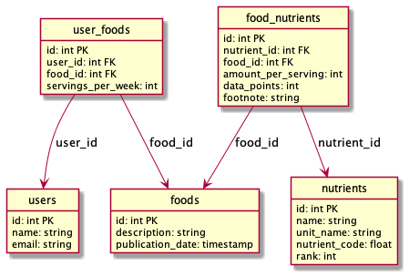

# foody

## Introduction

foody is a simple web application built to help developer candidates demonstrate practical skills with

* [GitHub](https://github.com/)
* [Git](https://git-scm.com/)
* [Docker](https://www.docker.com/)
* [MySQL 8](https://www.mysql.com/)
* [PHP 7](https://php.net/)
* [TypeScript](https://www.typescriptlang.org/)
* [Composer](https://getcomposer.org/)
* [npm](https://www.npmjs.com/)
* [Laravel 8](https://laravel.com/)
* [React](https://reactjs.org/)
* [NestJS](https://nestjs.com/)
* the editor of their choice
* the web developer tools of their choice (Chrome Developer Tools, Firebug, etc)

both before the interview (by completing the "Getting Started" steps) and during the interview (by solving simple problems hands-on with our team, either on screenshare or in-person).

By using foody in our interviews we hope to:

* **Reduce bias:** Candidates complete the same set of steps and problems as other candidates with the same experience for the same role.  Each problem has specific evaluation criteria.

* **Reduce the (unrealistic!) need for memorization:** Most developers can't memorize the names of every function, their arguments, and the precise details of how they behave, or recall them during an interview.  Candidates are free to use Google, Stack Overflow, man pages, documentation, tutorials, etc during their interview as they would normally.

* **Make interviews more efficient:** Candidates complete the "Getting Started" steps and prepare for their interview ahead of time, at their convenience, resulting in a shorter, more focused interview.

* **Make interviews more comfortable:** Candidates come to their interview having already seen the codebase they'll be solving problems in.

* **Provide realistic problems:** Candidates are given realistic problems to solve rather than trivia, logic puzzles, or trivial problems that can be introduced and set up entirely during the interview.

## Getting Started

### Introduction

The project is divided into four main subdirectories.
* **database**: a set of SQL files to create the database.
* **private-api**: a NestJS API to query the database (in a production environment this API would not be publicly accessile).
* **public-api**: a Laravel API used by the web layer.
* **web-ui**: a React application to interact with the public API.

### Getting started

foody is built on Docker, using MySQL, NestJS, Laravel and React.  In order to solve the problems during the interview, you will need a computer that's capable of running the application, and a user with rights to install the required tools.

### Install Docker and make

Install Docker and make.  The exact steps will vary depending on your operating system.

### Clone the application

Clone the application using the Github template repo.

### Start the application

Start the application using the Makefile in the project's root.

### Confirm the application is properly configured

The application should be accessible at [http://localhost:7755/](http://localhost:7755/).  

If everything was installed and configured correctly, you should see a web page welcoming you the the foody app.  If the app fails to start or doesn't work properly, you should figure out why by checking the output recevied during start up, and try to fix it.  (This isn't a test.  The app should start correctly following the instructions above.)

### Familiarize yourself with the basics of the application and the technologies used

foody is a simple web application for tracking the consumptions of foods and nutrients of a set of users.

## Disclaimer

foody is not by any means a finished product. It's not intended to run on a production server, and it's sole purpose is to run on a candidates computer in development mode.
